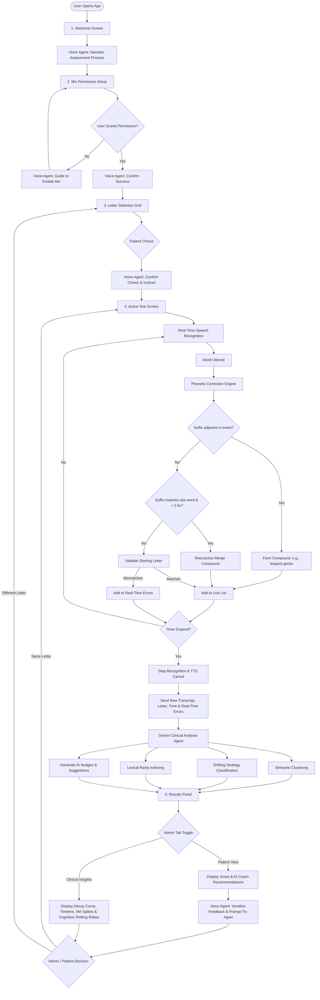

# NeuroFlow - Cognitive Assessment & Training Assistant (run now from google cloud run 'https://neuroflow-623422049137.us-west1.run.app/')

NeuroFlow is a premium, web-based verbal fluency practice and cognitive assessment application built using **React**, **TypeScript**, **Vite**, and styled with **Tailwind CSS**. It evaluates a user's verbal search and lexical retrieval capabilities by having them name as many animals as possible starting with a designated letter in a given time.

At the end of each test, NeuroFlow leverages the **Gemini 2.5 Flash API** to perform semantic clustering, calculate clinical metrics, identify unmapped words or repetitions, and provide personalized cognitive coaching suggestions.

---

## 🤖 Agentic Architecture & Kaggle Google Agents Contest Focus

NeuroFlow is designed as a **multi-agent cognitive assistant** tailored for neuro-developmental and clinical evaluation. Instead of using static validation algorithms, it implements a loop of real-time active speech agents and structured LLM diagnostic co-pilots:

### 1. The Real-Time Voice Agent (Onboarding & Nudge Interventions)
- **Active Onboarding**: Guides the user through microphone calibration and permission authorization using dynamic speech synthesis.
- **Cognitive Pause Interventions**: Monitors patient speaking frequency in real-time. If the agent detects a pause exceeding 7 seconds, it actively steps in with verbal cues (e.g. *"Keep going, you are doing great! Try thinking of water or farm animals starting with L."*) to stimulate frontal search networks.
- **Action Confirmation**: Verbally confirms chosen target letters to reassure users before commencing trials.

### 2. The LLM Diagnostic Co-Pilot (Structured Analysis Agent)
- **Autonomous Neurolinguistic Parsing**: The Gemini 2.5 Flash model behaves as a clinical evaluation agent. It parses raw transcript strings, categorizes animals into logical semantic families (mammals, marine, reptiles), and scores the patient's retrieval focus.
- **Cognitive Shifting Classification**: Evaluates word-to-word transition types (Semantic vs. Phonological/Alliteration vs. Unrelated) to map executive search strategies.
- **Dynamic Coaching Planner**: Analyzes naming gaps (e.g., if the user named only mammals) and plans custom categories (e.g., fish, birds) with starting letter examples to read back to the patient.
- **Strict Structured Outputs**: Guarantees zero-shot validation and structured JSON formatting for seamless storage, visualization, and interoperability with medical databases.

### 3. The Phonetic Correction & Utterance Merging Engine
- **Local Correction Agent**: Employs double-metaphone and edit-distance matching to resolve speech-to-text misinterpretations (e.g. converting `"lamp"` to `"lamb"` when target letter is L).
- **Temporal Merging**: Retroactively groups separated utterances (e.g. merging `"leopard"` and `"gecko"` spoken 1.5 seconds apart) to ensure compound names are preserved and prevent false-positive error flags.

---

## 📊 Agentic System Flowchart

The following diagram illustrates the lifecycle of the NeuroFlow cognitive assessment, tracing the user journey through onboarding, real-time voice agents, the phonetic/compound correction loop, and the Gemini analysis agent:



---

## 🚀 Getting Started

### Prerequisites
- **Node.js** (v18+ recommended)
- A **Gemini API Key** (set up in your environment)

### Local Configuration
Create a `.env.local` file in the root directory:
```env
VITE_GEMINI_API_KEY=your_gemini_api_key_here
```

### Installation & Execution
1. Install dependencies:
   ```bash
   npm install
   ```
2. Start the local development server:
   ```bash
   npm run dev
   ```
   The application will run at [http://localhost:5173/](http://localhost:5173/).

3. Build for production:
   ```bash
   npm run build
   ```

---

## 🛠️ Architecture & Clinical Features

### 1. Narrated Onboarding & Microphone Flow
- **Interactive Onboarding**: The test begins with a professional welcome screen detailing the evaluation process and vocalizing instructions via SpeechSynthesis.
- **Guided Permissions**: Dedicated onboarding screens verify microphone permissions. Narrators guide users step-by-step to click allow, indicating permission success or presenting helpful instructions upon denial.
- **Vocal Selection Feedback**: Re-enabled the letter selection feedback, notifying the patient via TTS which letter has been selected (e.g. *"You have chosen to name animals starting with the letter [SelectedLetter]."*).

### 2. Speech Interventions & Error Handling
- **Real-Time Corrections**: Employs a phonetic matching and edit-distance correction dictionary ([phoneticMatcher.ts](src/utils/phoneticMatcher.ts)) to match misheard words to correct animals on-the-fly.
- **Ignored Speech Abortions**: Gracefully catches transient Web Speech API `aborted` errors, preventing fatal lockups when TTS voice synthesis and speech recognition overlap.

### 3. Smart Compound Animal Name Processing
- **Curated Dictionary Expansion**: Contains common multi-word animals (e.g. *leopard gecko*, *sand crab*, *lyre bird*, *leatherback turtle*) mapped to their starting letters.
- **Intra-Event Combination**: Real-time parsing combines adjacent nouns (e.g. *"leopard"* + *"gecko"*) spoken in rapid succession into a single compound token.
- **Cross-Event Retroactive Merging**: If the user pauses and the Speech-to-Text engine transcribes the terms in separate events (e.g. transcribing *"leopard"*, then transcribing *"gecko"* 1.5 seconds later), the parser looks back at the timeline, retroactively merges them, updates the list, and bypasses false-positive `wrong-letter` errors for the second word.

### 4. Admin Settings Panel
Accessible via a gear icon on the top-right header across all pages:
- **Patient/User ID Configuration**: Tag and log results under specific patient names (e.g. `"Patient-1"`).
- **Test Duration Slider**: Dynamically configure assessment time lengths from `10s` to `120s` (immediately propagated to narration and Gemini AI assessment context).
- **Target Letter Grid List**: Edit, add, or remove target letters. The text input binds to a dedicated local text state to allow entering commas and spaces smoothly without cursor blocking.
- **Print Active Report**: Trigger the printable clinical PDF report directly from the settings panel. If an active test result is loaded, this closes the settings modal and launches the browser's native print dial.
- **Persistent Local Storage**: All settings are persistent across reloads and saved directly into the test results history.

### 5. Advanced Clinical Insights Dashboard
Administrators can toggle the results screen between **Patient View** (simple coaching feedback) and **Clinical Insights** (advanced diagnostics):
- **Retrieval Decay Curve (Temporal Dynamics)**: Plots the rate of word retrieval across equal thirds (epochs) of the test duration, visualizing prefrontal active search decay.
- **Chronological Word Timeline**: Lists all spoken terms (valid, repeated, or wrong starting letter) with absolute seconds, calculating the exact **Inter-Word Interval (IWI)** and flagging **Latency Spikes** (pauses $> 4.0\text{s}$) indicative of cognitive blocks.
- **Lexical Rarity Index**: Instructs the Gemini API to analyze naming complexity on a scale from 1.0 (common, e.g. *cat*) to 5.0 (exotic, e.g. *lemur*) representing lexical density and cognitive reserve.
- **Cognitive Shifting Strategy**: Classifies semantic transitions into *Semantic* (category cluster shifts), *Phonetic* (alliterations), or *Unrelated* categories, returning a neuro-clinical summary.
- **Printable Clinical PDF Report**: Renders a clean, structured medical-grade evaluation chart (containing Patient ID, Date, Score, AI executive summary, decay curve, metrics, and timeline) that is activated on-demand from the administrator settings panel, automatically closing the modal and hiding all interactive web UI components when printing.
- **Cumulative CSV History Export**: Exports all accumulated test logs into a structured `.csv` file for medical record keeping, academic research, or plotting in Excel, Python, or R.

---

## 🐛 Bug Fixes & Troubleshooting History

### 1. Speech Recognition 'aborted' fatal crash
- **Issue**: Starting the evaluation immediately crashed with `Speech recognition error: aborted`.
- **Root Cause**: The browser's native Web Speech API fires an `error` event with `event.error === 'aborted'` if started while other TTS voice synthesis processes are active or locking sound drivers. The old error handler was treating this as a fatal microphone error, transitioning the application state to `ERROR`.
- **Resolution**:
  - Updated `recognition.onerror` in [App.tsx](src/App.tsx) to explicitly check and ignore `aborted` errors, allowing transient restarts and application-triggered stops to be handled gracefully by `onend`.
  - Added an explicit `window.speechSynthesis.cancel()` call inside the `startTest` function to terminate any active speech announcements before starting speech recognition, avoiding sound driver conflicts.

### 2. Timer Freeze (Stale Closures)
- **Issue**: The application froze at the end of the timer (`0` or `1` second remaining) showing the list of animals but failing to progress to analysis or show controls.
- **Root Cause**: The `stopListening` callback closed over the initial `status` state. When called by `window.setInterval`'s timer callback, it evaluated the old stale status value and bypassed the status transition to `PROCESSING`, freezing the UI.
- **Resolution**: Rewrote the `stopListening` callback with empty dependencies and removed the conditional status check, ensuring the callback is stable and always processes the state transition correctly when the timer triggers it.

### 3. Font Size Scaling Overflow
- **Issue**: The labels on the Semantic, Phonetic, and Unrelated indicators were too large and broke the layout of the clinical cards.
- **Root Cause**: The custom class structures `text-2xs`, `text-3xs`, and `text-5xs` were not configured in standard Tailwind CSS, causing the browser to default to the standard parent body size (16px).
- **Resolution**: Replaced the custom class structures with standard Tailwind utility sizes (`text-xs`) and explicit arbitrary sizes (`text-[11px]`, `text-[10px]`, `text-[9px]`, and `text-[8px]`), packing them inside a tighter `gap-1.5` grid.
